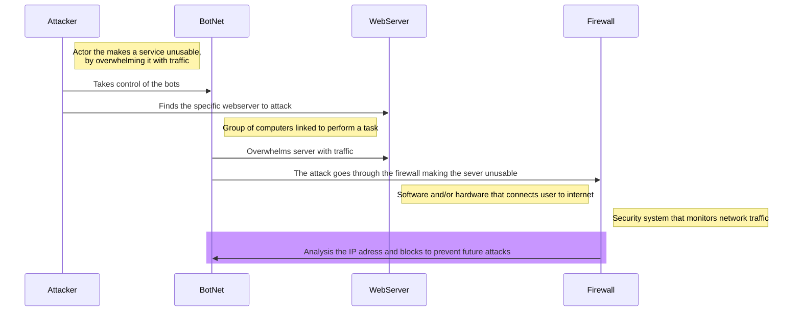

1. The Attacker will take control of a group of bots that will be ready to attack
2. Then the bots will go and attack the webserver by using heavy traffic,  which is more than the webserver can handle
3. If the IP isn't block by the firewall, all the users will not be able to acces to webserver
4. After the attack and once that IP adressed used in the attack, the firewall can be configured to recognize that IP and block it
## Contribution and Defensive Measures
The **Attacker** has an important because they know which server to attack and how it should be conducted.
**BotNet** is used by the Attacker so they can deploy the zombies to attack the **WebServer** which most of the time will be effective due to the ammount traffic it takes.
Once the WebServer has been compromised, the **Firewall** won't be able to do anything since it hasn't blocked the IP.
Now the WebServer will now be unaccessible to legitimate users and local devices since the traffic has mostly been filled up.
After the attack, IT can now identify the IP address from the attack and make it so that the Firewall can know the IP and block it from future attacks.
This procedure makes it that the WebServer can keep running smoothly.
Also, the Attacker won't be able to do the same attack again to the WebServer.
